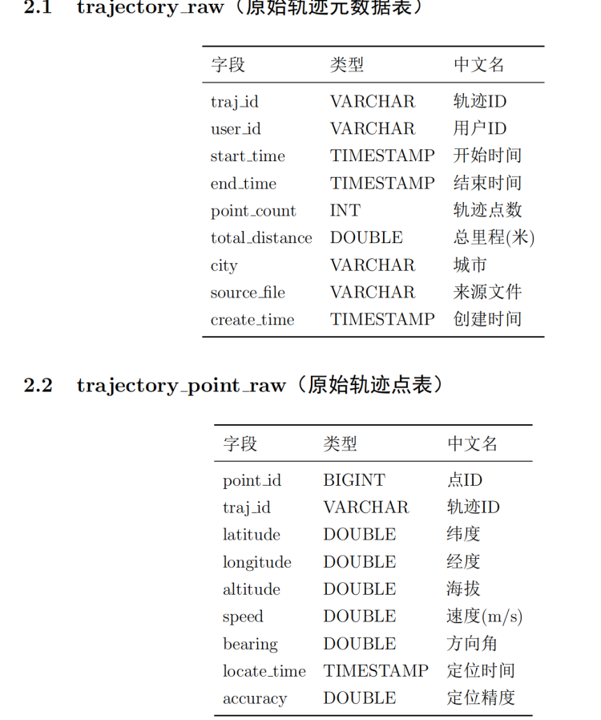
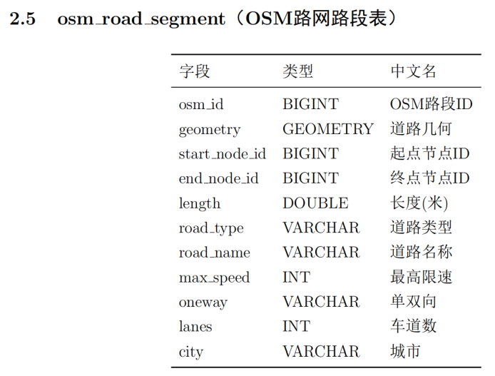
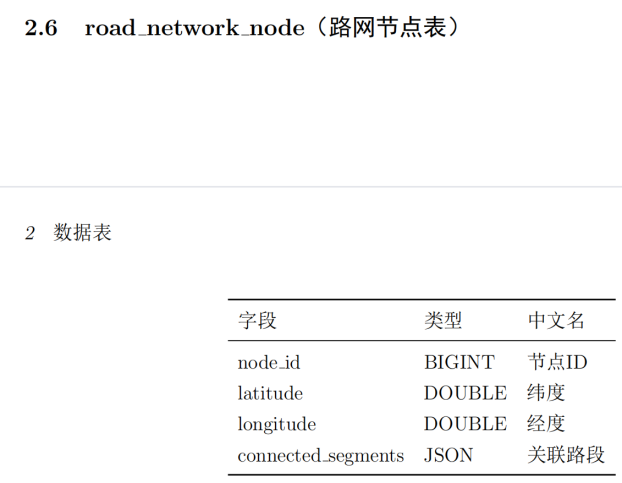
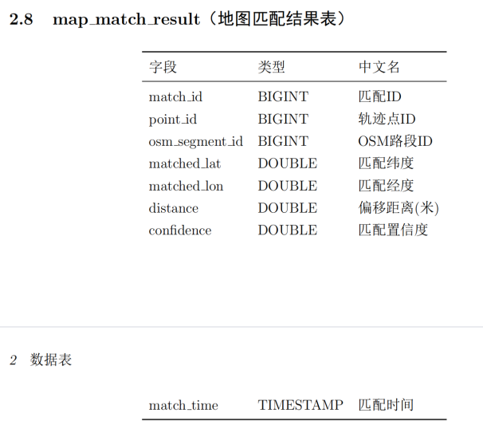

# 工作日志

## 7.31~8.7（工作计划）

### 将轨迹数据导入以下两个表

### 将OSM离线地图导入一下两个表

### 将轨迹点匹配到OSM的路段上，完成下面的表

注：匹配表本周完成能匹配的轨迹点的匹配，不能匹配的轨迹点后续完成匹配

### 详细分析轨迹中的轨迹点与OSM路段的匹配情况，分析出轨迹数据存在的问题和OSM离线地图存在的问题

### 根据分析出的问题设计下一周的工作（因为目前不清楚轨迹数据到底存在哪些问题，需要先进行初步匹配了解清楚轨迹的问题后在进行轨迹数据的清洗）

## 7.31~8.7（工作完成情况）

### 1、将轨迹数据导入表2.1，2.2

已完成 ✅

7 月 31 日至 8 月 7 日的轨迹数据已完成入库，包含 46,829 条轨迹、1,435 万个轨迹点。

### 2、将 OSM 离线地图导入表2.5，2.6

已完成 ✅

成都区域 OSM 离线路网（经度 103.97~104.16，纬度 30.53~30.76）已完成导入，覆盖机动车道路段（motorway/trunk/primary/secondary/tertiary/residential 等），包含 70,912 条路段和 62,131 个节点。

### 3、将轨迹点匹配到 OSM 的路段上，完成表2.8

已完成 ✅

**匹配方法对比**：

对比了两种开源地图匹配方法：

- TrackIt：处理 1000 条轨迹约需 1 小时，速度较慢

- FMM (Fast Map Matching)：处理 1000 条轨迹仅需 1 分钟，速度优势显著

最终采用 FMM 方案。FMM 基于隐马尔可夫模型（HMM），利用轨迹点的空间邻近性和路段拓扑连通性综合判断最佳匹配路径。目前已完成全量轨迹点匹配，输出文件 full_match_result_all.csv 共 14,350,780 条记录。两种方法在匹配精确性、召回率等指标上的对比尚未进行，后续可补充。

**输出字段**：每条记录包含轨迹点 ID、轨迹 ID、匹配到的 OSM 路段 ID、轨迹点坐标（lng/lat）、匹配点坐标（matched_lon/matched_lat）、匹配距离 distance（米）、置信度 confidence、匹配时间 match_time、距离范围分级 distance_range。

### 4、详细分析轨迹中的轨迹点与 OSM 路段的匹配情况，分析出轨迹数据存在的问题和 OSM 离线地图存在的问题

#### 4.1 数据概况

| 指标 | 数值 |
|------|------|
| 轨迹总数 | 46,829 条 |
| 匹配点总数 | 14,350,780 个 |
| 平均每轨迹点数 | 306.5 个 |

#### 4.2 整体匹配质量（所有匹配点距离分布）

| 距离范围 | 点数 | 占比 | 累计占比 |
|----------|------|------|----------|
| 0-5m（高精度） | 10,852,218 | 75.6% | 75.6% |
| 5-10m（良好） | 2,463,748 | 17.2% | 92.8% |
| 10-20m（可接受） | 525,266 | 3.7% | 96.5% |
| 20-30m（偏差较大） | 121,822 | 0.8% | 97.3% |
| 30-50m（严重偏差） | 143,336 | 1.0% | 98.3% |
| ≥50m（极差） | 244,390 | 1.7% | 100% |

**结论**：92.8% 的匹配点误差在 10m 以内，整体匹配质量良好。严重偏差（≥30m）的点仅占 2.7%，约 38.8 万个点。

#### 4.3 轨迹维度的偏差分级

按每条轨迹中最差的匹配点来分组：

| 轨迹最差距离 | 轨迹数 | 占比 | 解读 |
|-------------|--------|------|------|
| 全部 ≤5m | 564 | 1.2% | |
| 最差 5-10m | 6,585 | 14.1% | 整体良好，偶有轻微偏移 |
| 最差 10-20m | 15,019 | 32.1% | 最大群体，有个别路段偏移明显 |
| 最差 20-30m | 6,148 | 13.1% | 存在明显偏离路段 |
| 最差 30-50m | 6,547 | 14.0% | OSM 可能缺路或画偏 |
| 最差 ≥50m | 11,966 | 25.6% | 1/4 轨迹经过 OSM 缺失路段 |

对于含 ≥50m 的 11,966 条轨迹，绝大多数轨迹中 ≥50m 的大偏差点只占极少比例——不是整条轨迹都在偏，而是在某几个特定位置突然偏大后又恢复正常，这是 OSM 局部缺失路段的典型特征。

#### 4.4 ≥50m 偏差点的空间分布分析

为进一步区分"真缺路"和"GPS 漂移/匹配噪声"，对 244,390 个 ≥50m 偏差点的空间聚集情况进行了详细统计。

**（1）总体分布**

以 200m×200m 网格统计：

| 指标 | 数值 |
|------|------|
| ≥50m 点总数 | 244,390 |
| 分布网格数 | 10,142 个 |
| 平均每网格点数 | 24.1 |

**（2）网格频次分布**

| 每网格≥50m点数 | 网格数 | 占比 | 点数累计 | 解读 |
|----------------|--------|------|----------|------|
| 1 | 1,585 | 15.6% | 1,585 | 零星漂移 |
| 2-5 | 3,291 | 32.4% | 12,114 | 偶发噪声 |
| 6-10 | 1,944 | 19.2% | 26,937 | 可疑 |
| 11-20 | 1,482 | 14.6% | 48,541 | 可疑 |
| 21-50 | 1,151 | 11.3% | 85,066 | 可能缺路 |
| 51-100 | 370 | 3.6% | 111,233 | 很可能缺路 |
| 101-200 | 173 | 1.7% | 135,374 | 严重缺失 |
| 201-500 | 96 | 0.9% | 165,194 | 严重缺失 |
| 501-1000 | 26 | 0.3% | 183,442 | 严重缺失 |
| 1001-5000 | 20 | 0.2% | 220,474 | 重点区域 |
| 5000+ | 4 | 0.04% | 244,390 | 最重点区域 |

**（3）关键结论**：分布呈典型"长尾"形态

- 48.1% 的网格（4,876 个）仅含 ≤5 个 ≥50m 点，这些点仅贡献全部 ≥50m 点的 5.0%（12,114 个）。这部分大概率是 GPS 漂移或算法匹配噪声，**补路无法解决**。

- 1.4% 的网格（146 个，≥101 点）贡献了 ≥50m 点总数的 57% 以上，这是真正的缺路或严重匹配问题区域。

- 其中点数 ≥1001 的网格仅 24 个，是重中之重。

**（4）Top 24 高密度网格的空间关系**

对点数 ≥1001 的 24 个网格进行四邻域连通性分析：

| 连通情况 | 数量 | 说明 |
|----------|------|------|
| 孤立网格 | 21 个 | 各自独立，互不相邻 |
| 相邻网格对 | 3 对 | 每对 2 个网格相邻，覆盖约 0.08 km² |

这 24 个区域散布在成都各个方向——西边温江、西北郫都、市中心、东边龙泉驿、南边天府新区、北边新都等，并非集中在一个大片缺失区，而是**彼此独立的 21 个问题点**，每个点对应一组独立的缺路或匹配问题路段。

#### 4.5 轨迹数据存在的问题

**（1）坐标系偏移**

轨迹数据为 GCJ-02 坐标系，OSM 路网为 WGS-84 坐标系，两者存在约 300-500 米的系统偏移。匹配前已经进行了坐标转换。

**（2）GPS 定位漂移**

部分轨迹点存在 10-30m 的随机漂移，尤其在高层建筑密集区域。根据 ≥50m 点的网格分布分析，约 48% 的高密度网格仅含 ≤5 个 ≥50m 点，属于典型的 GPS 漂移噪声，难以通过补路消除。

**（3）轨迹采样间隔不均**

平均每条轨迹 306.5 个点，采样间隔约 2-5 秒，不同设备存在差异。稀疏采样的轨迹在弯道处可能产生线段跳变，影响匹配精度。

#### 4.6 OSM 离线地图存在的问题

**（1）路网缺失**

这是导致大偏差的最主要原因。≥50m 偏差集中于 21 个独立的重点区域（每个区域 1000+ 个偏差轨迹点），这些区域的共同特征是 OSM 中缺少对应的道路几何，导致大量车辆轨迹偏离最近路段 50m 以上。补充这些缺失路段后，预计可消除约 57% 的 ≥50m 偏差。

**（2）路网位置偏差**

部分 OSM 路段的几何位置与实际道路存在 20-50m 的偏移，可能是 OSM 志愿者绘制时精度不足导致。这类偏差造成了 30-50m 区间的大量匹配点。

**（3）路网拓扑不完整**

少量路段两端未与相邻路段正确连接，导致路口处匹配距离偏大。路口节点缺失或连接错误属于典型的 OSM 数据质量问题。

#### 4.7 综合结论

- 匹配质量总体良好（92.8% 的点在 10m 内），说明轨迹数据可用、OSM 路网主体覆盖较好。

- 大偏差并非全局性问题——仅 1.7% 的点和 25.6% 的轨迹涉及 ≥50m 偏差，且其中约一半的偏差空间上非常分散（≤5 点/网格），属于 GPS 漂移噪声，补路无法解决。

- **真正需要关注的补路区域约 21 个独立地点**，覆盖约 22 万个 ≥50m 轨迹点（占全部 ≥50m 点的 ~57%），分布在整个成都市的各个方向。

- 补充缺失路段是降低大偏差最直接有效的手段，但预期不能消除所有 ≥50m 偏差——GPS 漂移和匹配算法本身的误差仍然存在。
