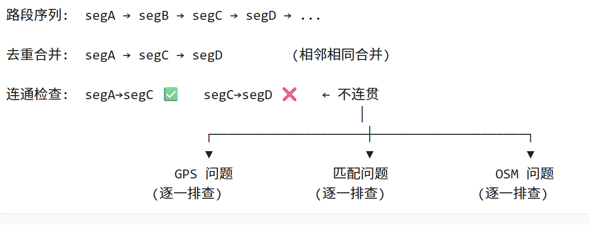

# 工作计划

## 8.8~8.14（工作计划）

## 1、匹配错误路段分级排查

### 总体思路

利用已完成的全量匹配结果 full_match_result_all.csv，逐条提取轨迹的匹配路段序列，通过检查路段连通性定位问题。每条轨迹按匹配质量分为三档依次排查，**凡出现路段不连贯，均从以下三个方向逐一诊断**：

**排查的三档顺序**：从最佳轨迹开始，逐步下探。

| 排查档位 | 轨迹范围 | 轨迹数 | 预计时间 |
|----------|----------|--------|----------|
| 第一档 | 全部 ≤5m | 564 | 1~2周 |
| 第二档 | 最差 5-10m | 6,585 | 1~2周 |
| 第三档 | 最差 10-20m | 15,019 | 1~2周 |
| 第四档 | 最差 20-30m | 6,148 | 1~2周 |
| 第五档 | 最差 ≥30m | 18,513 | 1~2周 |

**排查逻辑**：先查第一档——距离小、置信度高的轨迹，如果不连贯，这部分最确定，先查完。然后逐步下到第二、三档，用第一档积累的判断经验去区分 GPS/Match/OSM 三类问题。

### 排查路线一：GPS 轨迹本身的问题

| 可能的问题 | 具体表现 | 应对方法 |
|------------|----------|----------|
| 隧道/高架信号中断 | 前后两个轨迹点时间间隔很大（Δt>10秒），空间位置也跳了一大段（Δd>100m）。GPS信号被山体或混凝土完全屏蔽，出隧道后重新捕获卫星需要时间 | 将轨迹在此处切断，分成两条独立轨迹分别匹配。通过统计所有断点的Δt和Δd分布，确定最优切断阈值 |
| 长时间停车 | 车辆停了很久（Δt>60秒），但位置几乎没变（Δd<5m）。骑手停车取餐、休息或等红灯时，GPS在小范围内持续漂移 | 将轨迹在此处切断，停车段单独标记。避免FMM把静止漂移当作低速行驶匹配到错误路段 |
| GPS漂移点 | 瞬时速度异常（如 >40m/s=144km/h），远超摩托车实际速度。通常由高楼玻璃幕墙反射信号（多路径效应）或卫星组合突然变化导致 | 删除漂移点。通过统计速度分布确定合理上限（城市摩托车一般不超过80km/h），阈值设在35-40m/s |
| 冷启动定位延迟 | 轨迹前几个点位置不准或从远处跳过来。GPS接收器刚上电需要下载星历数据（冷启动），30秒到几分钟内定位误差很大 | 删除每条轨迹的前3-5个点。通过对比前几个点与后续点的位置一致性确定删除数量 |
| 静止漂移 | 车辆停止时GPS在半径5-10m内随机跳动。GPS在静止状态下缺少速度辅助，卡尔曼滤波效果变差，定位误差随机游走 | 将连续N个落在小范围内（如半径8m圆内）的点合并为一个质心点。减少FMM对无效数据的计算量 |

### 排查路线二：FMM 匹配本身的问题

| 可能的问题 | 具体表现 | 应对方法 |
|------------|----------|----------|
| 对向车道误配 | 双向道路两条平行边间距仅2-5m，轨迹点距离两个方向都差不多（<10m），FMM选错了方向。常见于道路起始段和低速转弯时 | 匹配后检查轨迹行进方向与路段方向的夹角：夹角>90°则为方向错配。标记为可疑，路段序列中排除该段的错误方向 |
| 平行路/辅路混淆 | 主路和辅路、高架和地面路在垂直投影上几乎重叠，两条路的候选距离非常接近，HMM在两个候选间难以区分 | 降低平行路区域的候选路段数量，缩小搜索半径。优先选择与轨迹前期路段拓扑连通的方向 |
| 路口歧义 | 路口处多条路段交汇，FMM的confidence很低（<0.3）。车辆在这个位置实际上在转弯，但HMM可能选错了分支 | 增加路口前后的轨迹点权重，利用转弯前后更多的点来做判断。对低confidence的路口段标记为"待确认" |
| 跨线跳变 | OSM把一条连续道路在每个交叉口切成多段（A、B、C、D），轨迹直行经过路口时FMM偶尔选错相邻段，造成A→C→B→D乱序 | 匹配后合并同一道路上连续的小段。过滤匹配点<3个的孤立段，认为是FMM的瞬时误跳 |
| 系统性困难场景 | 同一个osm_segment_id在大量轨迹上都出现低confidence或频繁跳变。说明该路段对FMM来说是固有的困难场景（如多层立交、双向紧邻等） | 将该路段标记为系统性困难路段。考虑在OSM中简化该区域的路网结构，或在此路段调整FMM的搜索参数 |

### 排查路线三：OSM 离线地图的问题

| 可能的问题 | 具体表现 | 应对方法 |
|------------|----------|----------|
| 悬空节点（拓扑缺失） | 匹配置信度高（distance<10m，confidence>0.5），但路段A和路段B在路网中不连通。检查发现两节点距离<5m但节点ID不同——OSM志愿者画到了路口但忘记把两端连起来 | 在路网中将两个悬空节点合并为一个，使路段A和路段B直接相连。这是确定的OSM Bug，修完后大量轨迹的连通性自动改善 |
| 路口未建模 | 两路段终端节点距离5-20m，但没有路口连接路段。车辆在这个路口实际是可以转弯的，但OSM路网中没有对应的转弯边 | 在两个节点之间新增一条连接边，标注为路口连接段。需要结合多条轨迹的通过方向确定该路口是否允许双向通行 |
| 路段几何偏移 | 同一个路段上的轨迹匹配偏差方向一致（如全都偏西南方向5-15m），说明OSM画的位置整体偏了。可能是OSM底图精度不足或人工绘制时参考了偏移的卫星图 | 将该路段上所有匹配点的偏差向量取平均值，用偏移量修正OSM路段的几何坐标。修正后该路段的匹配距离会整体下降 |
| 路段缺失 | ≥50m偏差连续出现，大量不同agent的轨迹在同一个区域走了同一条路，但OSM中完全没有对应路段。这是之前分析的21个重点区域（每个≥1000个≥50m点）的典型特征 | 提取区域内所有轨迹点做聚类，沿行进方向拟合出中心线作为新路段的几何。将新路段的头尾吸附到最近的OSM已有节点上，生成新路段数据和节点连接关系 |
| OSM路段数据过时 | 某区域的路网结构（如路口的转向规则、单行道方向）与实际不符，导致FMM选的路径虽然是合法但不符合实际行驶路线 | 通过对比大量轨迹的实际行驶路径和高德地图参考，确定正确的道路属性（方向、等级、转向限制），修正OSM元数据 |
